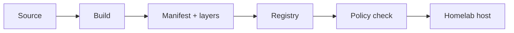

# Reading: Docker Images, Tags, Registries, and Provenance

**Module:** Module 8: Docker, Storage & Permissions
**Topic:** 02: Docker Images, Tags, Registries, and Provenance
**Activity type:** Reading / reference (Learn)
**Source:** Class 28 intake, published without rewriting lesson content

## Why this matters

`app:latest` tells an operator what someone called an image, not exactly which content ran. Tags can move. Registries can be compromised. Architectures can resolve to different manifests. A homelab that records registry, repository, tag, digest, source, and update decision can roll forward deliberately and roll back to known content.

## Core reading

An image is an immutable template assembled from content-addressed layers and configuration. A container adds a writable runtime layer and process state. A registry stores and distributes image manifests and blobs. A repository groups related images, while a tag is a mutable name inside that repository.

An image reference can be convenient (`registry/repository:tag`) or immutable (`registry/repository@sha256:digest`). The digest identifies a manifest by cryptographic hash. A multi-platform tag may first resolve to an index that selects a platform-specific manifest, so record platform as well as digest when reproducibility matters.

Image provenance answers: Who produced it? From what source? Through which build? What exact content was retrieved? What was scanned or signed? Which policy approved it? Labels, SBOMs, signatures, attestations, registry audit data, and pinned digests strengthen the answer, but no single field proves everything.

Use a controlled promotion pattern:

1. Discover a candidate tag.
2. Resolve and record its digest and platform.
3. Review source, release notes, SBOM/scan/signature evidence available to your environment.
4. Test the immutable candidate.
5. Promote the recorded digest.
6. Retain the last known-good reference and configuration for rollback.

Do not place registry credentials in image names, Dockerfiles, shell history, or lesson evidence. Prefer short-lived credentials and the platform's credential store.

## Worked example (study this)

An operator records `example/app:stable`, deploys it, and later recreates the container. The tag now resolves to a different digest. The configuration looks unchanged, but the binary content changed. Recording and approving `example/app@sha256:…` would make the change visible and reversible.

## Visual 1: Image Supply Path



The trust decision spans the entire path; pulling successfully proves availability, not trust.

## Visual 2: Name Versus Identity

```mermaid
flowchart TD
  T[Tag: app:1.4] -->|can be reassigned| D1[Digest A]
  T -. later .-> D2[Digest B]
  P[app@sha256:Digest-A] -->|fixed identity| D1
```

## Security and Rollback

- Treat registries and build pipelines as supply-chain trust boundaries.
- Never expose `/var/run/docker.sock` to an untrusted container.
- Prefer immutable digests for promoted deployments while preserving a human-readable tag in documentation.
- Keep secrets out of layers; deleting a later layer does not erase a secret from earlier history.

Rollback removes only the labeled lab image after confirming no dependent container exists:

```bash
docker ps -a --filter ancestor=academy-c28:1.0
docker image rm academy-c28:1.0
```

Preserve `/opt/lab-classroom/class28/` until evidence is graded; remove it later only with an explicitly reviewed path.

## Video Narration Notes

Open with two containers using the same tag but different digests. Animate the tag moving between fingerprints. Demonstrate the network-free build, inspect the image ID and labels, then close with the rule: tags communicate intent; digests preserve identity; provenance supports trust.
