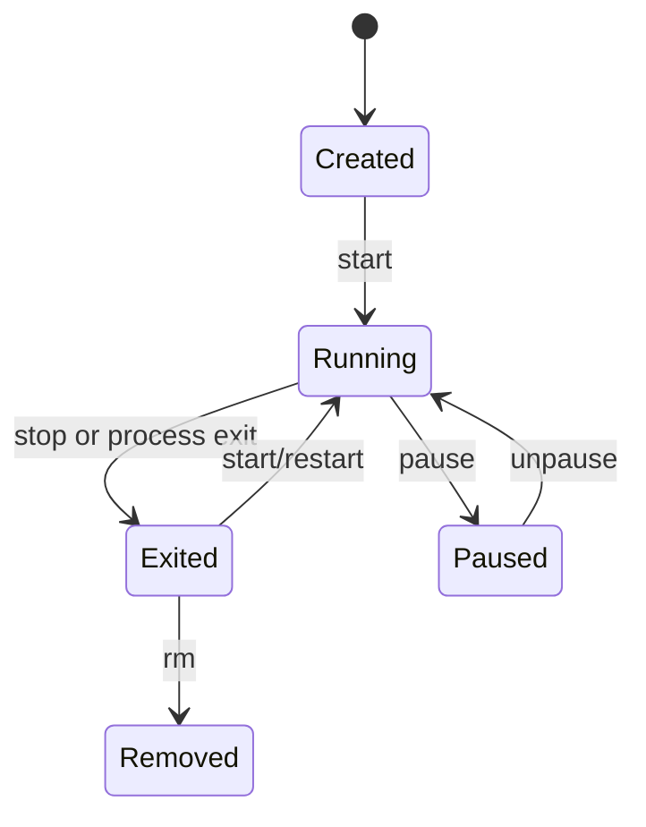
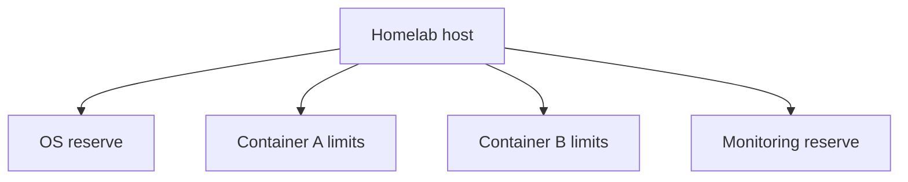

# Reading — Container Lifecycle and Resource Controls

**Module:** Module 8 — Docker, Storage & Permissions
**Topic:** 03 — Container Lifecycle and Resource Controls
**Activity type:** Reading / reference (Learn)
**Source:** Class 29 intake, published without rewriting lesson content

## Why this matters

A container without boundaries can exhaust memory, spawn excessive processes, or compete with Plex, Home Assistant, databases, and storage jobs. A restart loop can turn a small fault into constant disk and CPU pressure. Explicit lifecycle and resource policies make failures observable and contained.

## Core reading

`docker create` defines a container without starting it. `docker start` runs an existing container. `docker run` combines create and start. `docker stop` sends the configured stop signal, waits a grace period, then forces termination if necessary. `docker kill` sends a signal immediately; its default is `SIGKILL`. `docker rm` deletes container metadata and its writable layer but does not automatically delete every mounted volume.

Container state is not application health. `running` means a process exists. A health check can provide application-specific evidence, but a poor health check can create false confidence. Restart policies respond to process exit, not to every kind of application malfunction.

Resource controls depend on Linux kernel capabilities and cgroups. Memory limits bound allocation; CPU controls bound scheduling share or quota; PID limits reduce process-fork exhaustion. Reserve host capacity for the operating system and monitoring. Apply limits based on measurement, then test failure behavior.

Useful evidence includes `docker inspect`, `docker stats --no-stream`, `docker events`, exit codes, OOM indicators, and application logs. An exit code is a clue, not a complete root cause.

## Worked example (study this)

A media scanner with no memory limit consumes nearly all RAM. The kernel kills a database process instead, and several applications fail. The correct response is not merely an automatic restart: reserve host memory, set measured limits, observe peak usage, and test the scanner's behavior when constrained.

## Visual 1 — Lifecycle



## Visual 2 — Shared Host Boundary



## Security and Rollback

- Resource limits reduce availability risk but do not replace least privilege.
- Avoid `--privileged`, broad capabilities, host PID namespace, and Docker socket mounts.
- Validate restart behavior so failures do not become invisible loops.
- Record limits in Compose/configuration as code.

Rollback:

```bash
docker rm -f academy-c29 2>/dev/null || true
docker ps -a --filter label=academy.class=29
```

The cached BusyBox image may be retained for later labs. Remove it only after checking that no other container uses it.

## Video Narration Notes

Show the state diagram, then the container changing from created to running to exited. Highlight inspected limits, not just typed flags. Finish with a split-screen: restart loop versus bounded, observable failure.
