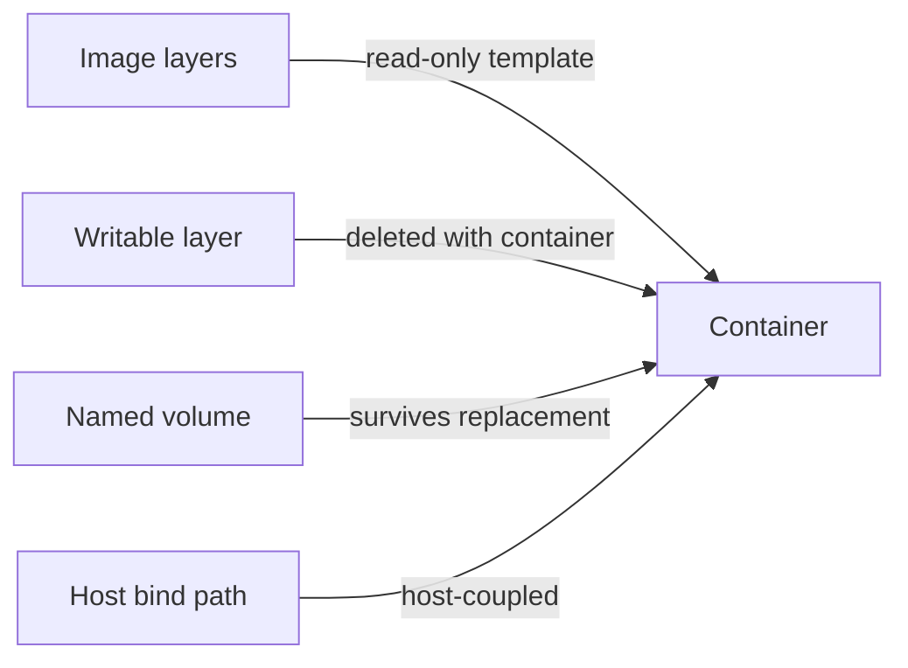
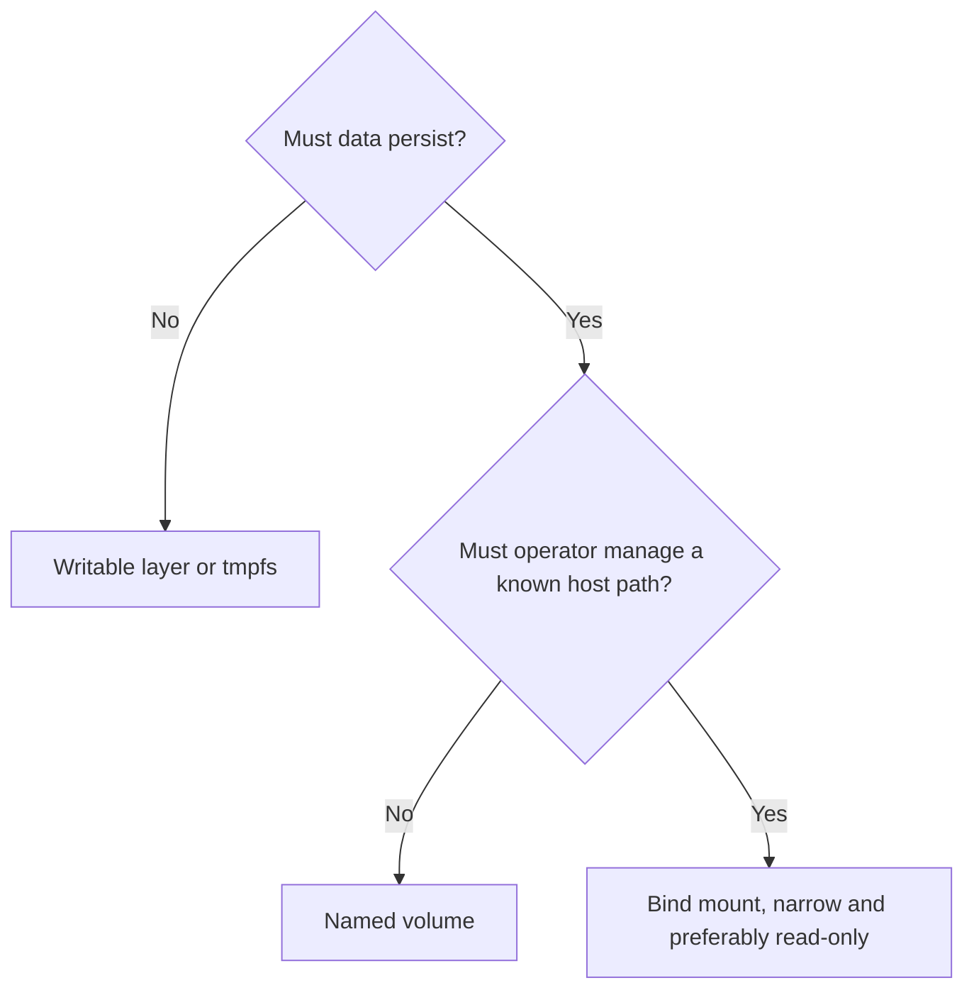

# Reading: Docker Volumes and Bind Mounts

**Module:** Module 8: Docker, Storage & Permissions
**Topic:** 04: Docker Volumes and Bind Mounts
**Activity type:** Reading / reference (Learn)
**Source:** Class 30 intake, published without rewriting lesson content

## Why this matters

Containers are replaceable; application data often is not. Storing a database only in a container's writable layer turns routine recreation into data loss. Mounting `/` or an oversized host directory creates a different danger: the container receives access to host data it never needed.

## Core reading

The writable layer belongs to one container and should hold disposable runtime changes. A named volume is managed through Docker and can be attached to replacement containers. A bind mount maps an explicit host path, which is useful for configuration or operator-managed datasets but couples the workload to host layout and permissions. A tmpfs mount stores ephemeral data in memory and disappears when the container stops.

Choose based on lifecycle and ownership:

- Named volume: application-owned durable data with Docker-managed location.
- Bind mount: operator-owned file/path that must be visible at a known host location.
- Read-only bind mount: configuration or reference data the container must not alter.
- tmpfs: sensitive or temporary data that should not persist, within memory constraints.

A mount hides image content at the same container path for as long as it is attached. Backups must match application consistency requirements. A stopped single-file application may tolerate filesystem-level archiving; databases often require application-aware dumps, snapshots, or coordinated quiescence.

## Worked example (study this)

A container writes configuration to `/config` without a mount. The operator updates by removing and recreating it, and the configuration disappears. The correct design attaches durable storage at `/config`, backs it up using an application-consistent method, and tests restoration before relying on it.

## Visual 1: Storage Lifetimes



## Visual 2: Selection Guide



## Security and Rollback

- Never mount the Docker socket for convenience.
- Avoid broad host mounts such as `/`, `/etc`, or a user's entire home directory.
- Use `:ro` when writes are unnecessary.
- Keep credentials outside ordinary images and backups; encrypt backups containing sensitive state.

After grading, remove only the two labeled lab volumes:

```bash
docker ps -a --filter volume=academy-c30 --filter volume=academy-c30-restore
docker volume inspect academy-c30 academy-c30-restore
docker volume rm academy-c30 academy-c30-restore
```

If either inspection shows unexpected data or dependencies, stop instead of deleting it.

## Video Narration Notes

Visually remove a container while its named volume remains, then attach the restored volume to a replacement container. Contrast that with a narrow read-only bind mount. Close on: persistence is a design decision; backup is proven only by restoration.
