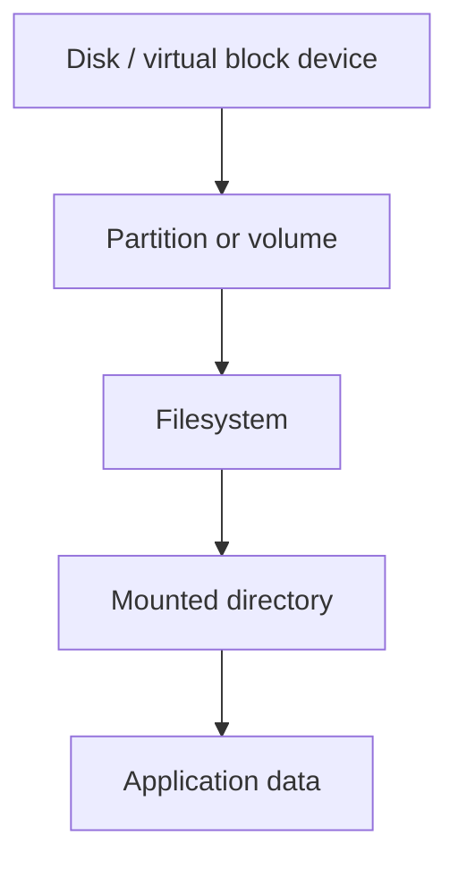
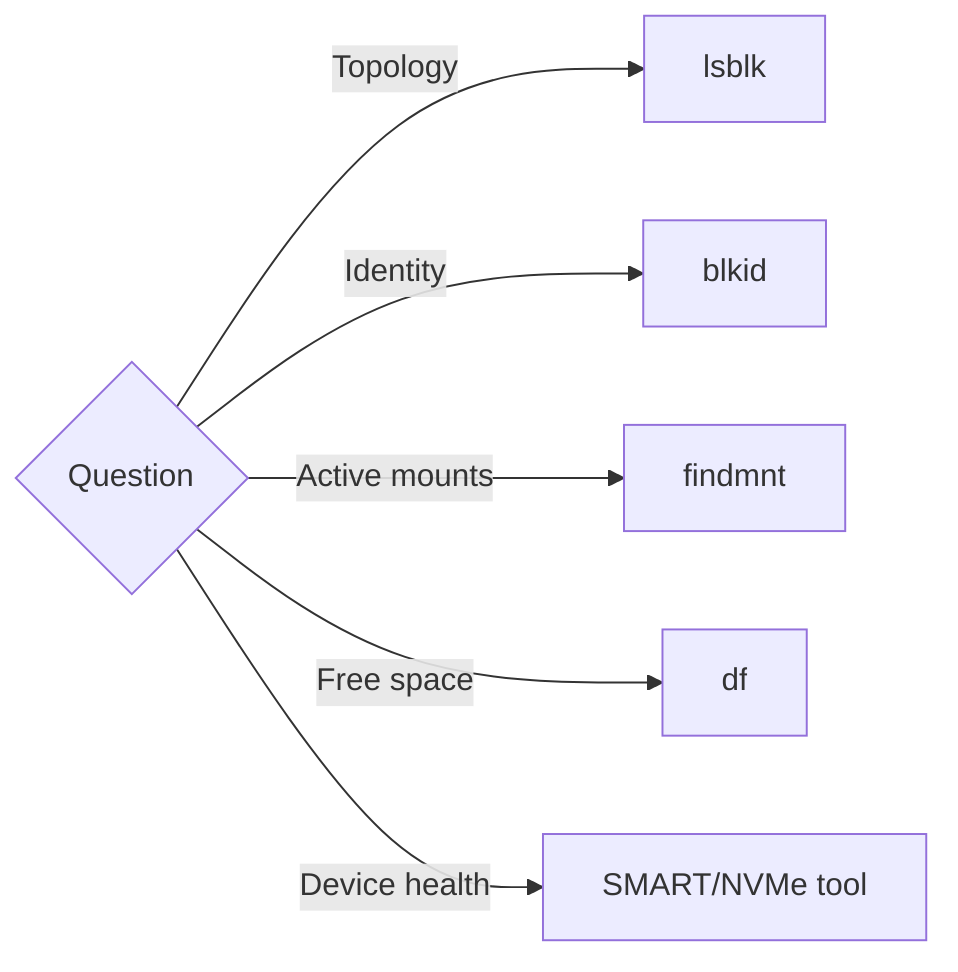

# Reading: Linux Disks, Partitions, and Filesystems

**Module:** Module 8: Docker, Storage & Permissions
**Topic:** 05: Linux Disks, Partitions, and Filesystems
**Activity type:** Reading / reference (Learn)
**Source:** Class 31 intake, published without rewriting lesson content

## Why this matters

Storage commands often succeed immediately and destroy evidence just as quickly. Confusing a disk with a partition, a filesystem with a mountpoint, or free space with disk health can erase data or hide the real problem. A homelab operator must identify the exact layer before changing it.

## Core reading

A disk is the underlying block device. A partition table describes subdivisions. A partition is a block-device region. A filesystem organizes files and metadata inside a block device or image. A mount attaches a filesystem to the directory tree. Linux can also use LVM, RAID, encryption, network filesystems, and datasets, so not every stack is simply disk → partition → filesystem.

Use evidence by layer:

- `lsblk`: block topology, sizes, filesystem hints, and mountpoints.
- `blkid`: filesystem type, label, and UUID signatures.
- `findmnt`: active mount relationships and options.
- `df`: allocated/available filesystem space.
- `du`: space attributable to visible directory entries.
- SMART/NVMe tools: device health indicators; separate from filesystem capacity.

Formatting creates filesystem structures and normally overwrites existing signatures. Partitioning changes the device map. Both require verified targets, backups, maintenance windows, and rollback/recovery planning. Never choose a target only because it “looks like the new disk.” Record model, serial, size, transport, existing signatures, and mounts.

The lab uses a regular sparse file, not a block device. `mkfs.ext4 -F` is intentionally destructive to that one file, so the command verifies the target is a regular file inside the class directory first.

## Worked example (study this)

`df` reports 95% usage under `/srv/media`. The underlying disk may be healthy, failing, thin-provisioned, or part of a larger stack; `df` alone cannot tell. Start with `findmnt` to identify the source, `lsblk` for topology, and the device/storage platform's health evidence before planning capacity work.

## Visual 1: Storage Stack



## Visual 2: Choose the Evidence Tool



## Security and Rollback

- Storage inventories can reveal infrastructure identifiers; redact before publishing.
- Untrusted removable media may contain hostile filesystems; mount with policy-appropriate restrictions and avoid automatic execution.
- Encryption protects data at rest only when keys and recovery materials are managed securely.

Rollback is deleting only the regular lab image after verifying the boundary:

```bash
LAB=/opt/lab-classroom/class31
test -f "$LAB/academy-c31.img" && test ! -b "$LAB/academy-c31.img" && rm -- "$LAB/academy-c31.img"
test ! -e "$LAB/academy-c31.img" && echo 'PASS: lab image removed'
```

## Video Narration Notes

Start with `/mnt/media` and peel backward through mount, filesystem, partition, and disk. Put a red boundary around `/dev/*`, then demonstrate the safe image-file filesystem. End by matching each diagnostic question to its evidence tool.
