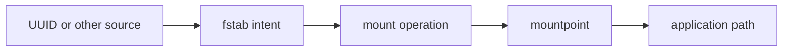
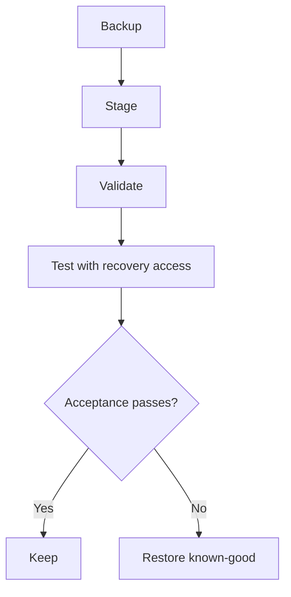

# Reading: Mounts, UUIDs, and fstab

**Module:** Module 8: Docker, Storage & Permissions
**Topic:** 06: Mounts, UUIDs, and fstab
**Activity type:** Reading / reference (Learn)
**Source:** Class 32 intake, published without rewriting lesson content

## Why this matters

A manual mount can work today and disappear after reboot. A bad persistent mount can delay boot, drop a host into emergency mode, or expose data with unsafe options. Device names such as `/dev/sdb1` can change; persistent identity and tested failure behavior matter.

## Core reading

Mounting attaches a filesystem source to a directory. The mountpoint's previous visible contents are hidden while the mount is active. Active state is visible through `findmnt` and `/proc/self/mountinfo`; persistent intent is commonly declared in `/etc/fstab`.

An `fstab` row contains source, mountpoint, filesystem type, options, dump field, and fsck pass. Sources may use `UUID=`, `LABEL=`, device path, or network syntax. UUIDs usually remain stable across device-name reordering, but cloning a filesystem can duplicate a UUID and reformatting creates a new one.

Options express behavior and security. `ro`, `nosuid`, `nodev`, and `noexec` may reduce risk for suitable data, but can break workloads that legitimately require writes, device nodes, set-ID behavior, or execution. `nofail` and systemd timeout/automount options can improve availability for noncritical devices, but must match service dependencies.

Safe change sequence:

1. Identify the exact source and current mounts.
2. Back up `/etc/fstab` and record permissions/ownership.
3. Create and verify the mountpoint.
4. Stage the proposed row in a separate file.
5. Validate syntax and source expectations.
6. Test in a maintenance window with recovery access available.
7. Verify application behavior and reboot behavior.
8. Restore the known-good file if acceptance checks fail.

## Worked example (study this)

A media disk is configured as `/dev/sdb1`. A new controller changes enumeration and another disk receives that name. A UUID-based entry better expresses which filesystem was intended, but only after verifying that the UUID is unique and belongs to the correct data.

## Visual 1: Mount Decision



## Visual 2: Safe Change Gate



## Security and Rollback

- Use the narrowest options compatible with the workload.
- Network mounts carry credential, trust, and availability concerns beyond local filesystems.
- Never paste secrets directly into broadly readable mount configuration.
- A successful `mount -a` does not replace application and reboot verification.

Lab rollback removes the staged file only:

```bash
LAB=/opt/lab-classroom/class32
test -f "$LAB/fstab.staged" && rm -- "$LAB/fstab.staged"
```

Real rollback: restore the timestamped known-good `/etc/fstab`, validate it, unmount only the affected noncritical mount when safe, and reboot only with recovery access and an approved window.

## Video Narration Notes

Show a device name changing while a UUID remains attached to the intended filesystem. Build the six-field row visually, run staged verification, and emphasize that the lesson never edits `/etc/fstab` or performs a real mount.
