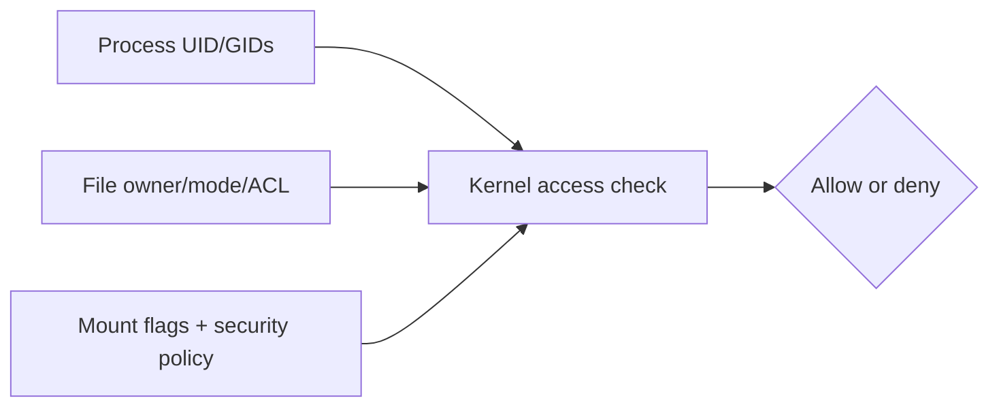
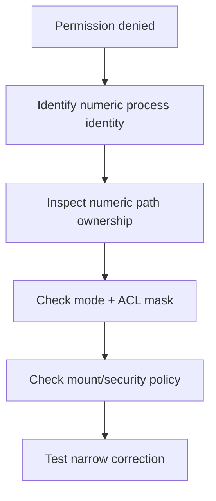

# Reading: PUID, PGID, ACLs, and Container File Access

**Module:** Module 8: Docker, Storage & Permissions
**Topic:** 07: PUID, PGID, ACLs, and Container File Access
**Activity type:** Reading / reference (Learn)
**Source:** Class 33 intake, published without rewriting lesson content

## Why this matters

Linux authorizes numeric identities, not matching display names. A container user named `media` may be UID 1000 while the host's `media` is UID 1500. The names look aligned, but the kernel sees different principals. Permission failures then tempt operators toward `chmod 777`, which trades a diagnosis problem for an access-control problem.

## Core reading

Every process has effective numeric user and group identities plus supplementary groups. Files have numeric owner/group, mode bits, and possibly ACL entries. On a bind mount, the same host inode is evaluated against the container process's numeric identity. A username inside `/etc/passwd` is only a label for a number.

PUID/PGID are conventions used by some container images: an entrypoint reads environment variables and runs or configures the application with those IDs. Docker itself does not universally interpret `PUID` or `PGID`; verify each image's documentation and effective process identity.

Diagnosis order:

1. Identify the path and whether it is a bind mount or volume.
2. Inspect container process UID, GID, and supplementary groups.
3. Inspect host numeric ownership (`ls -ln`) and every parent directory.
4. Inspect mode bits and ACLs (`getfacl`).
5. Inspect mount mode/options and read-only state.
6. Consider SELinux/AppArmor or network-filesystem identity mapping.
7. Test the smallest controlled change and verify both access and isolation.

ACLs allow named/numeric users or groups to receive permissions beyond the three basic classes. The ACL mask limits effective permissions for named users/groups and the owning group. Default ACLs on directories influence newly created children; they do not retroactively repair existing files.

## Worked example (study this)

A container is configured with `PUID=1000`, but the host data is owned by UID 1500 and mode `0750`. The container cannot traverse or write. `chmod 777` would expose the directory to every local identity. Better options include running the process with the intended existing identity, assigning a controlled shared group, or adding a narrow ACL after documenting the ownership model.

## Visual 1: Access Evaluation



## Visual 2: Diagnostic Funnel



## Security and Rollback

- Prefer non-root container processes and the smallest required access.
- Avoid recursive `chown` on large or shared datasets without an inventory and rollback plan.
- Do not use world-writable permissions as a diagnostic shortcut.
- Treat Docker socket access as host administration regardless of file ownership lesson goals.
- Back up ACLs with `getfacl -R` before approved ACL changes and restore with `setfacl --restore` when appropriate.

Lab rollback removes only files created inside the verified class directory:

```bash
LAB=/opt/lab-classroom/class33
test -d "$LAB/shared" && test "$LAB" = /opt/lab-classroom/class33 && rm -f -- "$LAB/shared/matching.txt" "$LAB/shared/denied.txt" "$LAB/shared/host.txt"
rmdir -- "$LAB/shared" 2>/dev/null || true
```

## Video Narration Notes

Put a UID number above a host process and a container process while hiding their usernames. Reveal that matching names have different numbers. Demonstrate one allowed and one denied write, then show the diagnostic funnel and reject `777` as a shortcut.
